# GlobeTalk - Diagrams

# Chatflow sequence 
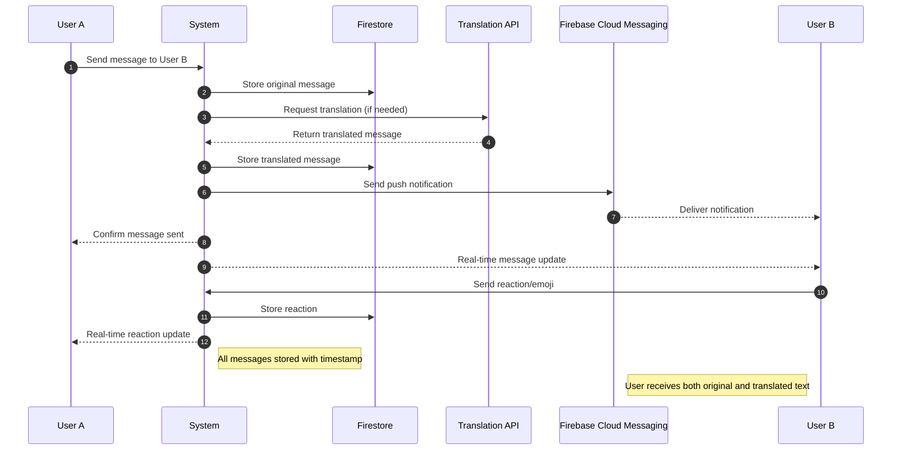

# Admin Moderation sequence

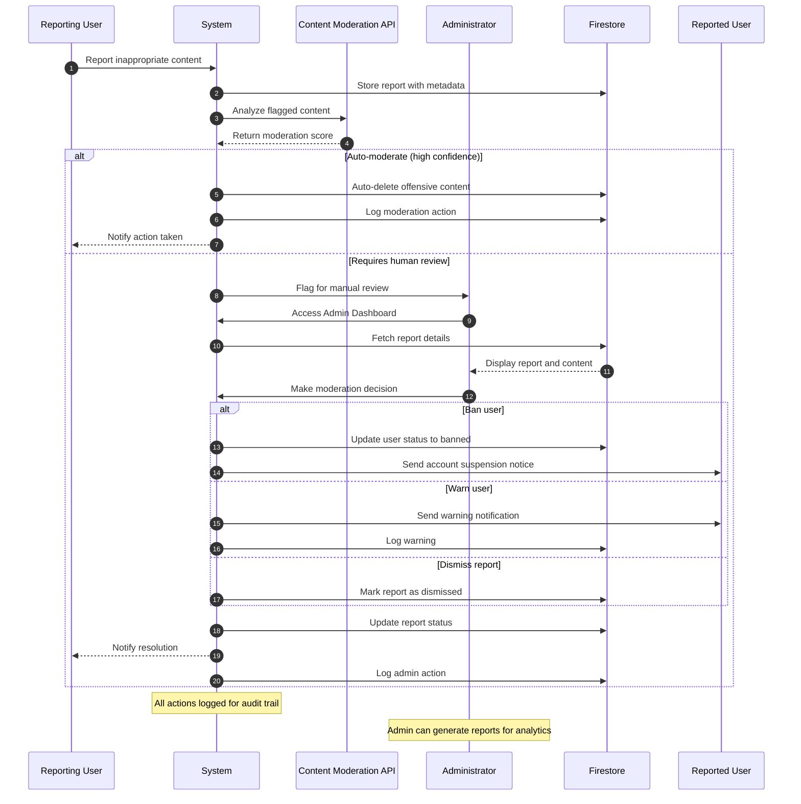
# Friendship System Sequence

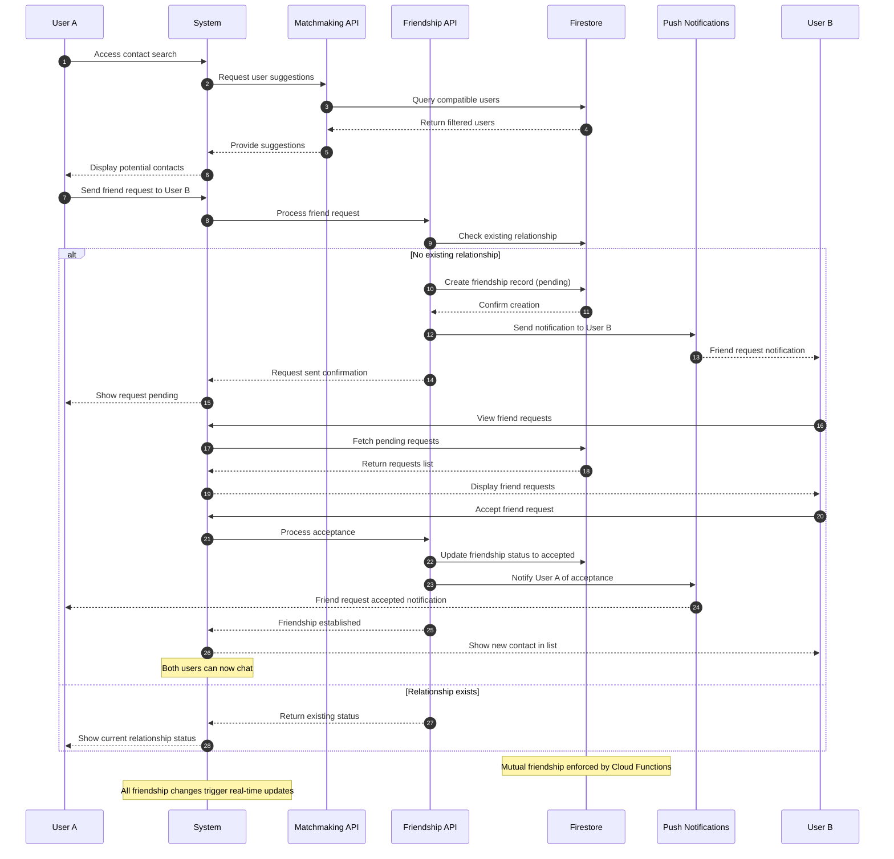

# UseCase Diagram 
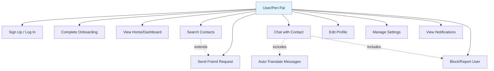
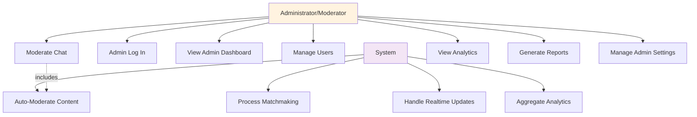

# Class Diagram

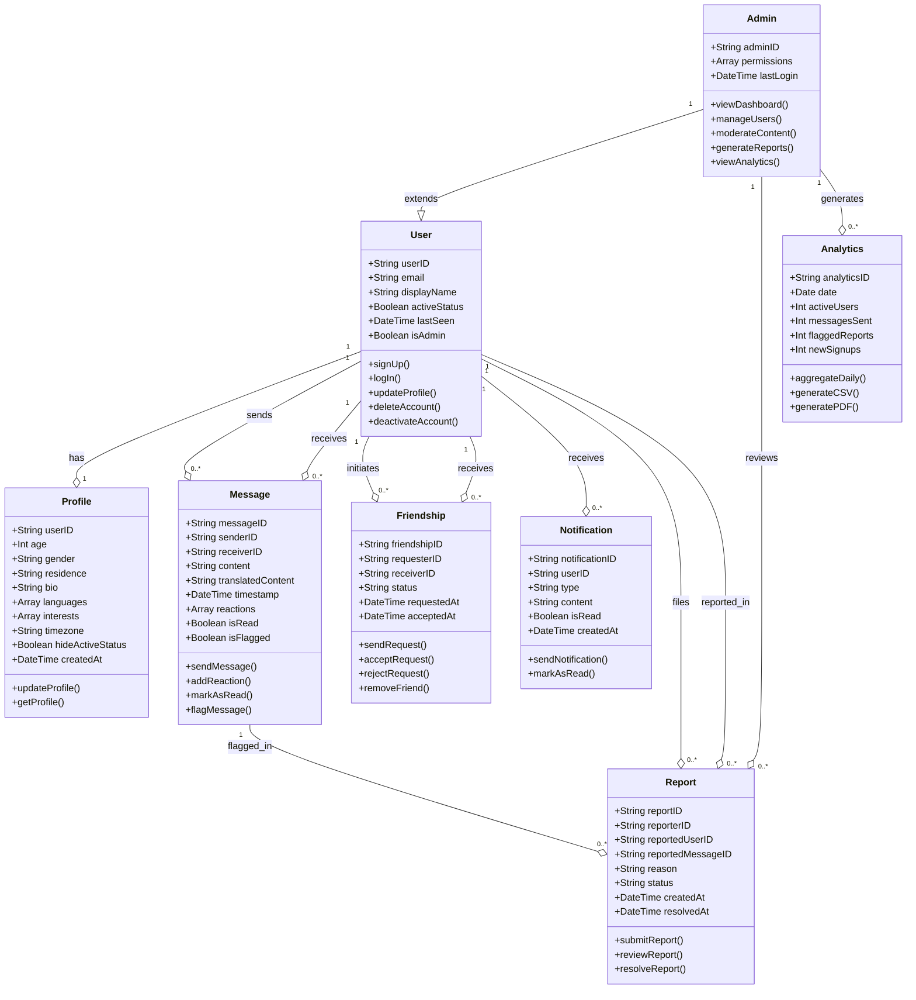

# Architecture diagram

```mermaid
graph TB
    subgraph "Client Layer"
        Web[Web App]
        Mobile[Mobile App]
    end
    subgraph "Authentication"
        Auth[Firebase Authentication]
        OAuth[Third-party OAuth]
    end
    subgraph "API Layer"
        Gateway[API Gateway]
        UserAPI[User Management API]
        ChatAPI[Chat API]
        MatchAPI[Matchmaking API]
        FriendAPI[Friendship System API]
        ModAPI[Moderation API]
        TransAPI[Translation API]
        SearchAPI[Search API]
        PrivacyAPI[Privacy Settings API]
        RoleAPI[Role-based Access Control API]
    end
    subgraph "Business Logic"
        Functions[Cloud Functions]
        MatchEngine[Matching Engine]
        ContentMod[Content Moderation]
        Analytics[Analytics Engine]
        NotificationService[Notification Service]
    end
    subgraph "Database Layer"
        Firestore[(Firestore)]
        Storage[Firebase Storage]
    end
    subgraph "External Services"
        FCM[Firebase Cloud Messaging]
        Azure[Azure Content Safety]
        Perspective[Perspective API]
        TranslationSvc[Translation Service]
    end
    subgraph "Admin Interface"
        AdminWeb[Admin Dashboard]
        Reports[Report Generator]
    end
    Web --> Gateway
    Mobile --> Gateway
    AdminWeb --> Gateway
    Web --> Auth
    Mobile --> Auth
    AdminWeb --> Auth
    Auth --> OAuth
    Gateway --> UserAPI
    Gateway --> ChatAPI
    Gateway --> MatchAPI
    Gateway --> FriendAPI
    Gateway --> ModAPI
    Gateway --> TransAPI
    Gateway --> SearchAPI
    Gateway --> PrivacyAPI
    Gateway --> RoleAPI
    UserAPI --> Functions
    ChatAPI --> Functions
    MatchAPI --> MatchEngine
    FriendAPI --> Functions
    ModAPI --> ContentMod
    Functions --> Firestore
    MatchEngine --> Firestore
    ContentMod --> Firestore
    Analytics --> Firestore
    UserAPI --> Storage
    NotificationService --> FCM
    ContentMod --> Azure
    ContentMod --> Perspective
    TransAPI --> TranslationSvc
    Functions --> FCM
    Reports --> Functions
    Analytics --> Reports
    Firestore -.->|Real-time listeners| Web
    Firestore -.->|Real-time listeners| Mobile
    classDef clientLayer fill:#e3f2fd
    classDef apiLayer fill:#f3e5f5
    classDef businessLayer fill:#e8f5e8
    classDef dataLayer fill:#fff3e0
    classDef externalLayer fill:#fce4ec
    classDef adminLayer fill:#f1f8e9
    class Web,Mobile clientLayer
    class Gateway,UserAPI,ChatAPI,MatchAPI,FriendAPI,ModAPI,TransAPI,SearchAPI,PrivacyAPI,RoleAPI apiLayer
    class Functions,MatchEngine,ContentMod,Analytics,NotificationService businessLayer
    class Firestore,Storage dataLayer
    class FCM,Azure,Perspective,TranslationSvc externalLayer
    class AdminWeb,Reports adminLayer
```

# Data Flow Diagram

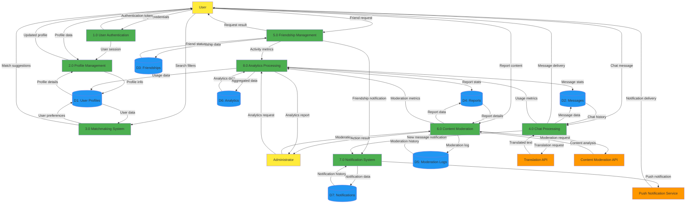

# Component Diagram
```mermaid
graph TB
    subgraph "Frontend Components"
        WebApp[Web Application]
        MobileApp[Mobile Application]
        AdminDash[Admin Dashboard]
        
        subgraph "Web App Modules"
            AuthComp[Authentication Component]
            ChatComp[Chat Component]
            ProfileComp[Profile Component]
            SearchComp[Search Component]
            NotifComp[Notification Component]
        end
        
        subgraph "Mobile App Modules"
            MAuthComp[Mobile Auth Component]
            MChatComp[Mobile Chat Component]
            MProfileComp[Mobile Profile Component]
            MSearchComp[Mobile Search Component]
            MNotifComp[Mobile Notification Component]
        end
        
        subgraph "Admin Modules"
            AdminAuth[Admin Authentication]
            UserMgmt[User Management]
            ContentMod[Content Moderation]
            Analytics[Analytics Dashboard]
            ReportGen[Report Generator]
        end
    end
    
    subgraph "Backend Components"
        APIGateway[API Gateway]
        
        subgraph "Core Services"
            UserService[User Service]
            ChatService[Chat Service]
            MatchService[Matchmaking Service]
            FriendService[Friendship Service]
            ModerationService[Moderation Service]
            NotificationService[Notification Service]
            AnalyticsService[Analytics Service]
        end
        
        subgraph "Infrastructure Components"
            AuthProvider[Firebase Auth Provider]
            DatabaseLayer[Database Access Layer]
            StorageLayer[Storage Access Layer]
            CloudFunctions[Cloud Functions Runtime]
        end
    end
    
    subgraph "External Services"
        TranslationAPI[Translation API]
        ContentModerationAPI[Content Moderation API]
        PushService[Push Notification Service]
        ThirdPartyAuth[OAuth Providers]
    end
    
    subgraph "Data Layer"
        Firestore[(Firestore Database)]
        FirebaseStorage[Firebase Storage]
        Cache[Redis Cache]
    end
    
    %% Frontend to Backend connections
    WebApp --> APIGateway
    MobileApp --> APIGateway
    AdminDash --> APIGateway
    
    %% Component internal connections
    WebApp --> AuthComp
    WebApp --> ChatComp
    WebApp --> ProfileComp
    WebApp --> SearchComp
    WebApp --> NotifComp
    
    MobileApp --> MAuthComp
    MobileApp --> MChatComp
    MobileApp --> MProfileComp
    MobileApp --> MSearchComp
    MobileApp --> MNotifComp
    
    AdminDash --> AdminAuth
    AdminDash --> UserMgmt
    AdminDash --> ContentMod
    AdminDash --> Analytics
    AdminDash --> ReportGen
    
    %% API Gateway to Services
    APIGateway --> UserService
    APIGateway --> ChatService
    APIGateway --> MatchService
    APIGateway --> FriendService
    APIGateway --> ModerationService
    APIGateway --> NotificationService
    APIGateway --> AnalyticsService
    
    %% Services to Infrastructure
    UserService --> AuthProvider
    UserService --> DatabaseLayer
    ChatService --> DatabaseLayer
    ChatService --> CloudFunctions
    MatchService --> DatabaseLayer
    FriendService --> DatabaseLayer
    FriendService --> CloudFunctions
    ModerationService --> DatabaseLayer
    ModerationService --> CloudFunctions
    NotificationService --> CloudFunctions
    AnalyticsService --> DatabaseLayer
    AnalyticsService --> CloudFunctions
    
    %% Infrastructure to Data Layer
    DatabaseLayer --> Firestore
    StorageLayer --> FirebaseStorage
    DatabaseLayer --> Cache
    
    %% External Service connections
    AuthProvider --> ThirdPartyAuth
    ChatService --> TranslationAPI
    ModerationService --> ContentModerationAPI
    NotificationService --> PushService
    CloudFunctions --> PushService
    
    %% Real-time connections
    Firestore -.->|Real-time listeners| ChatComp
    Firestore -.->|Real-time listeners| MChatComp
    Firestore -.->|Real-time listeners| NotifComp
    Firestore -.->|Real-time listeners| MNotifComp
    
    classDef frontend fill:#e3f2fd
    classDef backend fill:#e8f5e8
    classDef external fill:#fff3e0
    classDef data fill:#f3e5f5
    
    class WebApp,MobileApp,AdminDash,AuthComp,ChatComp,ProfileComp,SearchComp,NotifComp,MAuthComp,MChatComp,MProfileComp,MSearchComp,MNotifComp,AdminAuth,UserMgmt,ContentMod,Analytics,ReportGen frontend
    class APIGateway,UserService,ChatService,MatchService,FriendService,ModerationService,NotificationService,AnalyticsService,AuthProvider,DatabaseLayer,StorageLayer,CloudFunctions backend
    class TranslationAPI,ContentModerationAPI,PushService,ThirdPartyAuth external
    class Firestore,FirebaseStorage,Cache data
```

# Deployment diagram

```mermaid
graph TB
    subgraph "Client Devices"
        subgraph "User Devices"
            Browser[Web Browser]
            MobileDevice[Mobile Device]
        end
        
        subgraph "Admin Devices"
            AdminBrowser[Admin Web Browser]
        end
    end
    
    subgraph "CDN / Load Balancer"
        CDN[Content Delivery Network]
        LoadBalancer[Load Balancer]
    end
    
    subgraph "Google Cloud Platform"
        subgraph "Firebase Hosting"
            WebServer[Static Web Assets]
            AdminWeb[Admin Interface]
        end
        
        subgraph "App Engine / Cloud Run"
            APIServer1[API Server Instance 1]
            APIServer2[API Server Instance 2]
            APIGateway[API Gateway]
        end
        
        subgraph "Cloud Functions"
            CF1[Matchmaking Functions]
            CF2[Moderation Functions]
            CF3[Analytics Functions]
            CF4[Notification Functions]
        end
        
        subgraph "Firebase Services"
            FireAuth[Firebase Authentication]
            FireDB[(Firestore Database)]
            FireStorage[Firebase Storage]
            FCM[Firebase Cloud Messaging]
        end
        
        subgraph "Monitoring & Logging"
            CloudLogging[Cloud Logging]
            CloudMonitoring[Cloud Monitoring]
            ErrorReporting[Error Reporting]
        end
    end
    
    subgraph "External Services"
        TranslateAPI[Google Translate API]
        AzureContent[Azure Content Safety]
        PerspectiveAPI[Perspective API]
        OAuth[OAuth Providers<br/>Google, Facebook, etc.]
    end
    
    subgraph "Mobile App Stores"
        AppStore[Apple App Store]
        PlayStore[Google Play Store]
    end
    
    %% Client connections
    Browser -->|HTTPS| CDN
    MobileDevice -->|HTTPS/WSS| LoadBalancer
    AdminBrowser -->|HTTPS| CDN
    
    %% CDN and Load Balancer
    CDN --> WebServer
    CDN --> AdminWeb
    LoadBalancer --> APIGateway
    
    %% API Gateway routing
    APIGateway --> APIServer1
    APIGateway --> APIServer2
    
    %% API Server connections
    APIServer1 --> CF1
    APIServer1 --> CF2
    APIServer1 --> CF3
    APIServer1 --> CF4
    APIServer2 --> CF1
    APIServer2 --> CF2
    APIServer2 --> CF3
    APIServer2 --> CF4
    
    %% Cloud Functions to Firebase
    CF1 --> FireDB
    CF2 --> FireDB
    CF3 --> FireDB
    CF4 --> FireDB
    CF4 --> FCM
    
    %% Firebase connections
    APIServer1 --> FireAuth
    APIServer2 --> FireAuth
    APIServer1 --> FireDB
    APIServer2 --> FireDB
    APIServer1 --> FireStorage
    APIServer2 --> FireStorage
    
    %% External API connections
    CF1 --> TranslateAPI
    CF2 --> AzureContent
    CF2 --> PerspectiveAPI
    FireAuth --> OAuth
    
    %% Mobile app distribution
    MobileDevice -.->|Download/Update| AppStore
    MobileDevice -.->|Download/Update| PlayStore
    
    %% Real-time connections
    FireDB -.->|Real-time updates| Browser
    FireDB -.->|Real-time updates| MobileDevice
    FCM -.->|Push notifications| MobileDevice
    
    %% Monitoring connections
    APIServer1 --> CloudLogging
    APIServer2 --> CloudLogging
    CF1 --> CloudMonitoring
    CF2 --> CloudMonitoring
    CF3 --> CloudMonitoring
    CF4 --> CloudMonitoring
    APIServer1 --> ErrorReporting
    APIServer2 --> ErrorReporting
    
    %% Deployment specifications
    WebServer -.->|"Static Files<br/>React/Vue Build"| Browser
    AdminWeb -.->|"Admin SPA<br/>React Dashboard"| AdminBrowser
    APIServer1 -.->|"Node.js/Python<br/>Auto-scaling"| APIGateway
    APIServer2 -.->|"Node.js/Python<br/>Auto-scaling"| APIGateway
    
    classDef client fill:#e3f2fd
    classDef hosting fill:#e8f5e8
    classDef compute fill:#fff3e0
    classDef database fill:#f3e5f5
    classDef external fill:#fce4ec
    classDef monitoring fill:#f1f8e9
    
    class Browser,MobileDevice,AdminBrowser,AppStore,PlayStore client
    class CDN,LoadBalancer,WebServer,AdminWeb hosting
    class APIServer1,APIServer2,APIGateway,CF1,CF2,CF3,CF4 compute
    class FireAuth,FireDB,FireStorage,FCM database
    class TranslateAPI,AzureContent,PerspectiveAPI,OAuth external
    class CloudLogging,CloudMonitoring,ErrorReporting monitoring
```
# User State Diagram
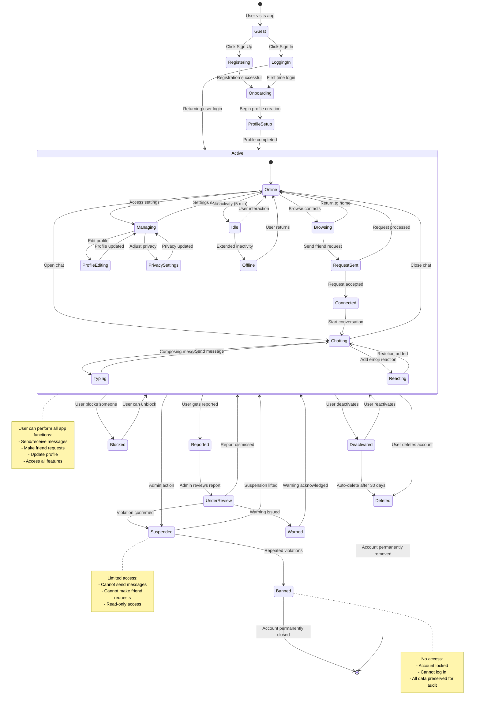
# Chat State Diagram

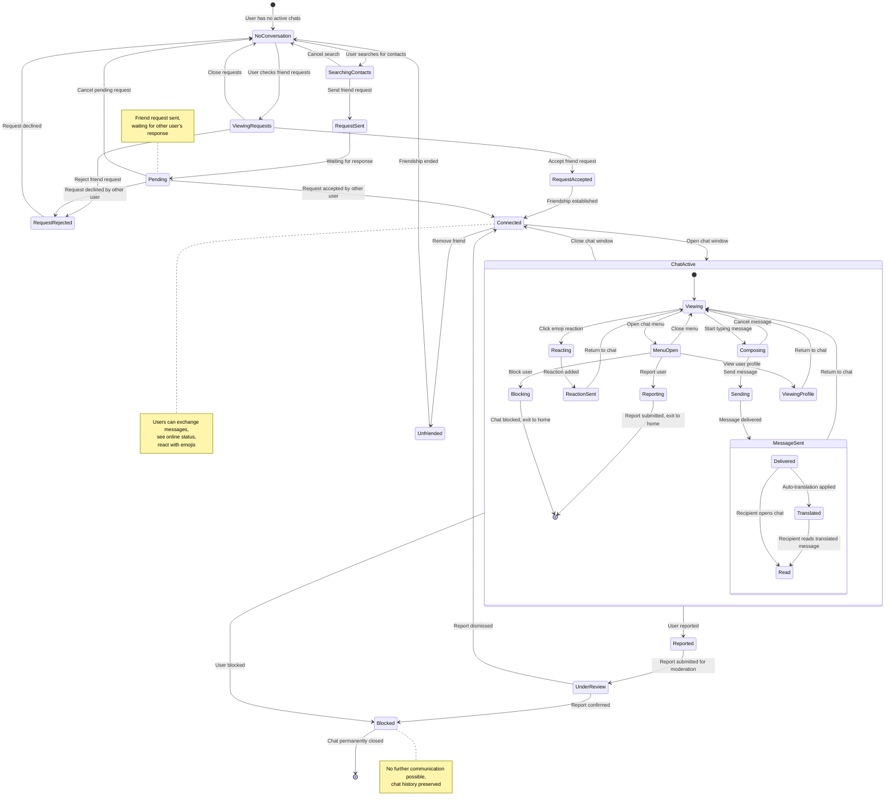

# Activity Diagrams

# Activity Diagram (User Registration Flow)
```mermaid
flowchart TD
    Start([User starts registration])
    
    ChooseAuth{Choose authentication method}
    EmailAuth[Enter email and password]
    OAuthAuth[Select OAuth provider]
    
    ValidateEmail{Email valid?}
    ValidateOAuth{OAuth successful?}
    
    CreateAccount[Create Firebase account]
    AccountExists{Account already exists?}
    
    SendVerification[Send verification email]
    WaitVerification[Wait for email verification]
    CheckVerification{Email verified?}
    
    StartOnboarding[Begin onboarding process]
    
    %% Profile Setup Flow
    EnterBasicInfo[Enter age and gender]
    ValidateBasic{Information valid?}
    
    EnterLocation[Enter residence/location]
    ValidateLocation{Location valid?}
    
    EnterLanguages[Select spoken languages]
    ValidateLanguages{At least one language?}
    
    EnterInterests[Add interests and hobbies]
    
    WriteBio[Write personal bio]
    ValidateBio{Bio appropriate?}
    
    SetPrivacy[Configure privacy settings]
    
    ReviewProfile[Review profile information]
    ConfirmProfile{Confirm profile?}
    
    SaveProfile[Save to Firestore]
    ProfileSaved{Profile saved successfully?}
    
    GenerateMatches[Generate initial matches]
    
    ShowWelcome[Show welcome message]
    RedirectHome[Redirect to Home/Dashboard]
    
    End([Registration complete])
    
    %% Error handling
    ShowEmailError[Show email format error]
    ShowOAuthError[Show OAuth error]
    ShowLoginOption[Show login option]
    ShowVerificationError[Resend verification email]
    ShowValidationError[Show field validation error]
    ShowBioError[Show inappropriate content warning]
    ShowSaveError[Show save error, retry]
    
    %% Flow connections
    Start --> ChooseAuth
    
    ChooseAuth -->|Email| EmailAuth
    ChooseAuth -->|OAuth| OAuthAuth
    
    EmailAuth --> ValidateEmail
    ValidateEmail -->|No| ShowEmailError
    ShowEmailError --> EmailAuth
    ValidateEmail -->|Yes| CreateAccount
    
    OAuthAuth --> ValidateOAuth
    ValidateOAuth -->|No| ShowOAuthError
    ShowOAuthError --> ChooseAuth
    ValidateOAuth -->|Yes| CreateAccount
    
    CreateAccount --> AccountExists
    AccountExists -->|Yes| ShowLoginOption
    ShowLoginOption --> ChooseAuth
    AccountExists -->|No| SendVerification
    
    SendVerification --> WaitVerification
    WaitVerification --> CheckVerification
    CheckVerification -->|No| ShowVerificationError
    ShowVerificationError --> WaitVerification
    CheckVerification -->|Yes| StartOnboarding
    
    StartOnboarding --> EnterBasicInfo
    EnterBasicInfo --> ValidateBasic
    ValidateBasic -->|No| ShowValidationError
    ShowValidationError --> EnterBasicInfo
    ValidateBasic -->|Yes| EnterLocation
    
    EnterLocation --> ValidateLocation
    ValidateLocation -->|No| ShowValidationError
    ValidateLocation -->|Yes| EnterLanguages
    
    EnterLanguages --> ValidateLanguages
    ValidateLanguages -->|No| ShowValidationError
    ValidateLanguages -->|Yes| EnterInterests
    
    EnterInterests --> WriteBio
    WriteBio --> ValidateBio
    ValidateBio -->|No| ShowBioError
    ShowBioError --> WriteBio
    ValidateBio -->|Yes| SetPrivacy
    
    SetPrivacy --> ReviewProfile
    ReviewProfile --> ConfirmProfile
    ConfirmProfile -->|No| EnterBasicInfo
    ConfirmProfile -->|Yes| SaveProfile
    
    SaveProfile --> ProfileSaved
    ProfileSaved -->|No| ShowSaveError
    ShowSaveError --> SaveProfile
    ProfileSaved -->|Yes| GenerateMatches
    
    GenerateMatches --> ShowWelcome
    ShowWelcome --> RedirectHome
    RedirectHome --> End
    
    classDef startEnd fill:#ffcdd2
    classDef process fill:#c8e6c9
    classDef decision fill:#fff9c4
    classDef error fill:#ffcccb
    
    class Start,End startEnd
    class EmailAuth,OAuthAuth,CreateAccount,SendVerification,StartOnboarding,EnterBasicInfo,EnterLocation,EnterLanguages,EnterInterests,WriteBio,SetPrivacy,ReviewProfile,SaveProfile,GenerateMatches,ShowWelcome,RedirectHome process
    class ChooseAuth,ValidateEmail,ValidateOAuth,AccountExists,CheckVerification,ValidateBasic,ValidateLocation,ValidateLanguages,ValidateBio,ConfirmProfile,ProfileSaved decision
    class ShowEmailError,ShowOAuthError,ShowLoginOption,ShowVerificationError,ShowValidationError,ShowBioError,ShowSaveError error
```

# Message Processing Activity Diagram

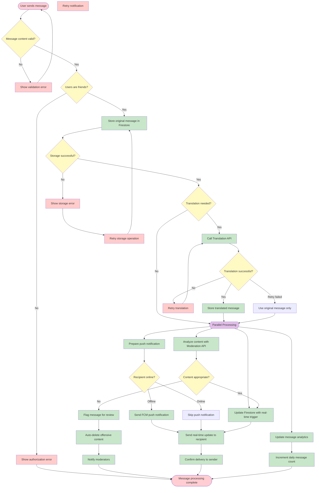

# Admin Moderation Activity Diagram

# GlobeTalk - Admin Moderation Activity Diagram

```mermaid
flowchart TD
    Start([Admin starts moderation review])
    
    AccessDashboard[Access Admin Dashboard]
    CheckReports{Pending reports available?}
    
    NoReports[No reports to review]
    SelectReport[Select report to review]
    
    LoadReportDetails[Load report details from Firestore]
    ReviewContent[Review flagged content]
    CheckContext[Check conversation context]
    ReviewUserHistory[Review user's moderation history]
    
    MakeDecision{Moderation decision}
    
    %% Decision branches
    DismissReport[Dismiss report as invalid]
    WarnUser[Issue warning to user]
    SuspendUser[Suspend user account]
    BanUser[Permanently ban user]
    DeleteContent[Delete specific content]
    
    %% Dismiss flow
    UpdateReportStatus1[Update report status to dismissed]
    NotifyReporter1[Notify reporter of decision]
    LogAction1[Log dismissal action]
    
    %% Warning flow
    SendWarningNotification[Send warning notification to user]
    UpdateReportStatus2[Update report status to resolved]
    LogAction2[Log warning action]
    NotifyReporter2[Notify reporter of action taken]
    
    %% Suspension flow
    UpdateUserStatus1[Update user status to suspended]
    SetSuspensionDuration[Set suspension duration]
    SendSuspensionNotification[Send suspension notification]
    UpdateReportStatus3[Update report status to resolved]
    LogAction3[Log suspension action]
    NotifyReporter3[Notify reporter of action taken]
    
    %% Ban flow
    UpdateUserStatus2[Update user status to banned]
    SendBanNotification[Send ban notification]
    UpdateReportStatus4[Update report status to resolved]
    LogAction4[Log ban action]
    NotifyReporter4[Notify reporter of action taken]
    ArchiveUserData[Archive user data for audit]
    
    %% Delete content flow
    RemoveOffensiveContent[Remove flagged content]
    UpdateMessageStatus[Mark message as deleted]
    UpdateReportStatus5[Update report status to resolved]
    LogAction5[Log content deletion]
    NotifyReporter5[Notify reporter of action taken]
    
    %% Analytics update
    UpdateAnalytics[Update moderation analytics]
    
    CheckMoreReports{More reports to review?}
    
    GenerateReport{Generate summary report?}
    CreateCSVReport[Generate CSV report]
    CreatePDFReport[Generate PDF report]
    DownloadReport[Download report file]
    
    End([Moderation session complete])
    
    %% Flow connections
    Start --> AccessDashboard
    AccessDashboard --> CheckReports
    
    CheckReports -->|No| NoReports
    CheckReports -->|Yes| SelectReport
    NoReports --> End
    
    SelectReport --> LoadReportDetails
    LoadReportDetails --> ReviewContent
    ReviewContent --> CheckContext
    CheckContext --> ReviewUserHistory
    ReviewUserHistory --> MakeDecision
    
    MakeDecision -->|Dismiss| DismissReport
    MakeDecision -->|Warning| WarnUser
    MakeDecision -->|Suspend| SuspendUser
    MakeDecision -->|Ban| BanUser
    MakeDecision -->|Delete Content| DeleteContent
    
    %% Dismiss path
    DismissReport --> UpdateReportStatus1
    UpdateReportStatus1 --> NotifyReporter1
    NotifyReporter1 --> LogAction1
    LogAction1 --> UpdateAnalytics
    
    %% Warning path
    WarnUser --> SendWarningNotification
    SendWarningNotification --> UpdateReportStatus2
    UpdateReportStatus2 --> LogAction2
    LogAction2 --> NotifyReporter2
    NotifyReporter2 --> UpdateAnalytics
    
    %% Suspension path
    SuspendUser --> UpdateUserStatus1
    UpdateUserStatus1 --> SetSuspensionDuration
    SetSuspensionDuration --> SendSuspensionNotification
    SendSuspensionNotification --> UpdateReportStatus3
    UpdateReportStatus3 --> LogAction3
    LogAction3 --> NotifyReporter3
    NotifyReporter3 --> UpdateAnalytics
    
    %% Ban path
    BanUser --> UpdateUserStatus2
    UpdateUserStatus2 --> SendBanNotification
    SendBanNotification --> UpdateReportStatus4
    UpdateReportStatus4 --> LogAction4
    LogAction4 --> NotifyReporter4
    NotifyReporter4 --> ArchiveUserData
    ArchiveUserData --> UpdateAnalytics
    
    %% Delete content path
    DeleteContent --> RemoveOffensiveContent
    RemoveOffensiveContent --> UpdateMessageStatus
    UpdateMessageStatus --> UpdateReportStatus5
    UpdateReportStatus5 --> LogAction5
    LogAction5 --> NotifyReporter5
    NotifyReporter5 --> UpdateAnalytics
    
    %% Continue flow
    UpdateAnalytics --> CheckMoreReports
    CheckMoreReports -->|Yes| SelectReport
    CheckMoreReports -->|No| GenerateReport
    
    GenerateReport -->|Yes CSV| CreateCSVReport
    GenerateReport -->|Yes PDF| CreatePDFReport
    GenerateReport -->|No| End
    
    CreateCSVReport --> DownloadReport
    CreatePDFReport --> DownloadReport
    DownloadReport --> End
    
    classDef startEnd fill:#ffcdd2
    classDef process fill:#c8e6c9
    classDef decision fill:#fff9c4
    classDef action fill:#fff3e0
    
    class Start,End,NoReports startEnd
    class AccessDashboard,LoadReportDetails,ReviewContent,CheckContext,ReviewUserHistory,UpdateReportStatus1,UpdateReportStatus2,UpdateReportStatus3,UpdateReportStatus4,UpdateReportStatus5,UpdateAnalytics,CreateCSVReport,CreatePDFReport,DownloadReport process
    class CheckReports,MakeDecision,CheckMoreReports,GenerateReport decision
    class DismissReport,WarnUser,SuspendUser,BanUser,DeleteContent,SendWarningNotification,SendSuspensionNotification,SendBanNotification,RemoveOffensiveContent,UpdateUserStatus1,UpdateUserStatus2,LogAction1,LogAction2,LogAction3,LogAction4,LogAction5 action
```
